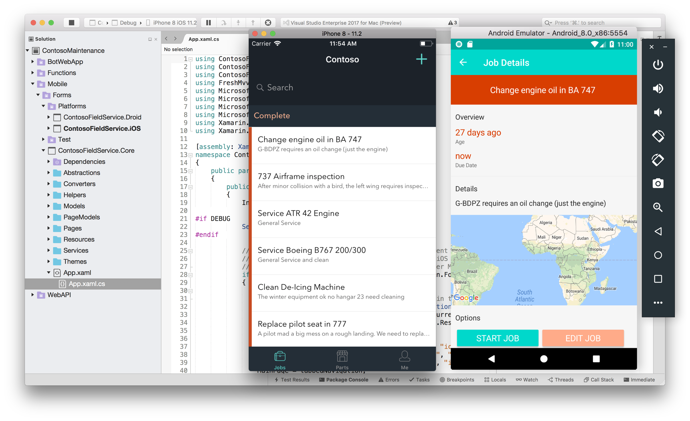

# Setting Up

> **Hint:** We highly recommend you setup and configure your system *before* attending the mobile workshop. Although we’ve allowed an hour in the morning to assist in trouble shooting configurations, we won’t have time to do a fresh installation.

## Prerequisites

Please bring your own **Windows or Mac** laptop. To participate in this workshop, some prework needs to be done. So please make sure you prepared your environment bringing the following prerequisites.

- [Microsoft Azure Account](https://aka.ms/azft-mobile) (with a Subscription)
- [Visual Studio for Windows or Mac](https://www.visualstudio.com/) (Community Version or higher)
  - [Xamarin Tooling](https://developer.xamarin.com/guides/cross-platform/getting_started/installation/windows/)
- [Visual Studio Code](https://code.visualstudio.com/)
  - [Azure Functions Extension](https://marketplace.visualstudio.com/items?itemName=ms-azuretools.vscode-azurefunctions)
- [Postman](https://www.getpostman.com/)

The setup of a Xamarin development environment can get a little bit tricky and time consuming as it has dependancies on many SDKs and technologies from different companies.

## Prepare your environment

### Microsoft Azure

Creating a Microsoft Azure Account is easy! Just head over to the [Azure Website](https://azure.microsoft.com/en-us/free/) and create a free Account. If you already have a Microsoft, Outlook, Office 365 or Active Directory Account from you company, you can re-use it.

Although the free Account includes a bunch of services that you can use, in this workshop we will work with advanced resources, which we need an Azure Subscription for.

An Azure Subscriptuon is basically the way to pay for charged services and can be backed by a Credit Card or a company agreement.

You can check the Subscriptions for you account when visiting the [Azure Portal](https://portal.azure.com) and selecting ***Subscriptions*** from the side menu.

If no Subscriptions appear, visit the [Azure Subscription Portal](https://account.azure.com/Subscriptions) to add one.

### Mobile Development with Xamarin

#### Windows

When working in Windows, Visual Studio will be the best IDE for you! You can check internally if you have a license for the paid versions or even go with the free Community Edition. Both will work for you.

Please [follow this guide](https://developer.xamarin.com/guides/cross-platform/getting_started/installation/windows/) to install the Xamarin Tooling for Visual Studio on Windows and make sure, you have at least Android API Level 16 and an Android Emulator installed.

When working on Windows, you won't be able to build iOS solutions unless you connect your machine with a Mac in your network. To follow this workshop, an iOS configuration is not mandatory! [Follow this guide](https://developer.xamarin.com/guides/ios/getting_started/installation/windows/) if you want to connect to a Mac Build Host anyway.

#### Mac

When using a Mac, the best Xamarin Tooling provides Visual Studio for Mac. Xamarin should be installed during the installation of Visual Studio. Please [follow this guide](https://docs.microsoft.com/en-us/visualstudio/mac/installation) to make sure you don't miss anything.

If you want to build iOS solutions, make sure that XCode is also installed on the same device!

#### Test your configuration

To make sure your environment works as expected and is able to compile and execute Xamarin apps, your can simply open the [`ContosoMaintenance.sln`](/ContosoMaintenance.sln) solution with Visual Studio and select the `ContosoFieldService.iOS` or `ContosoFieldService.Droid` project as your Startup project. If the application gets compiled and the app can be started, you are good to go.

# Next Steps 
[Archicture Options](../02_Architecture_Options/README.md)
