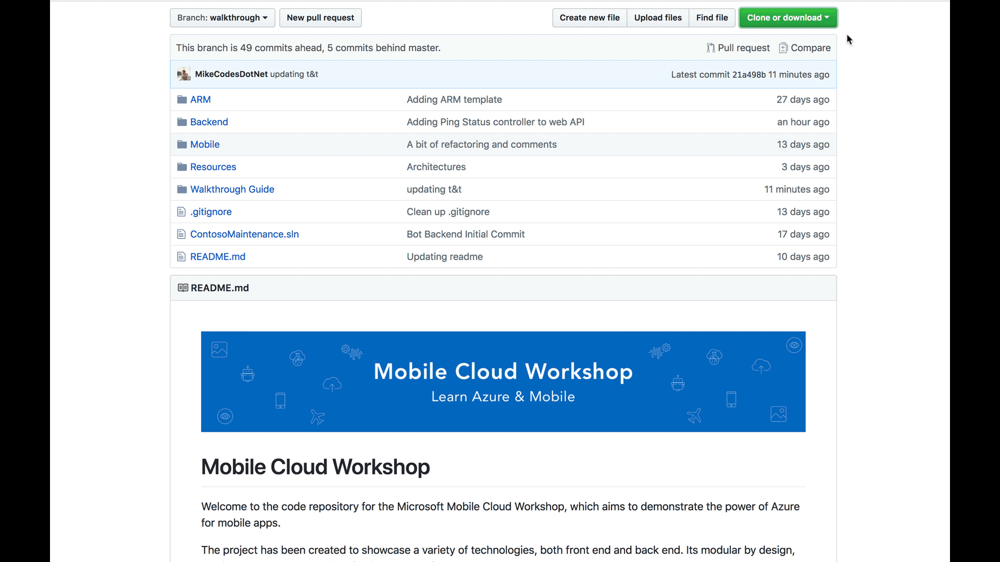

# Welcome  
Welcome to the Azure Mobile Workshop. Today you’re going to learn how to leverage your existing skills to build highly reliable backend systems to power a modern cross platform mobile app built using Xamarin.Forms. 

We’ve tried to make this app as production ready as possible and provide a good foundation for if you wish to pursue development in the future. Think of this as your development starter kit. Where we think theres area for improvement within the code base,you’ll find explanations about how to improve them. We've tried to pick non oppinionated frameworks to give you the flexibility to extend this app to fit your requirements. 

## 1. Clone the project to your development machine
The entire solution is available to download from Github and licensed under MIT for use in your own projects. To clone the repository, head over to the [project on Github](https://github.com/MikeCodesDotNet/Mobile-Cloud-Workshop) and select "Clone or download". We'll opt to clone to a local directory. Alternatively, if you're unfamilair with GIT version control systems then you may wish to download the solution as a ZIP file. 

## 1. Mobile App

The mobile app currently run on both iOS and Android devices. UWP, macOS and Linux support should technically also work but they're outside the scope of todays learnings. 

### 1.1 Development SDK
The apps have been built with Xamarin.Forms targetting .NET Standard 2.0. You should find all your favourite .NET libraries will work with the both the backend (also targeting .NET Standard 2.0) and the mobile apps.  

### 1.2 Mvvm with FreshMvvm
We opted to use [FreshMvvm](https://github.com/rid00z/FreshMvvm) as our Mvvm library due to its small size and flexibility. Its specifically designed for Xamarin.Forms and offers lots of helpful extensions around navigation which we make full use of. 

## 2. Azure Architecture 

### 2.1 API Management 

### 2.2 App Services

### 2.3 Services

