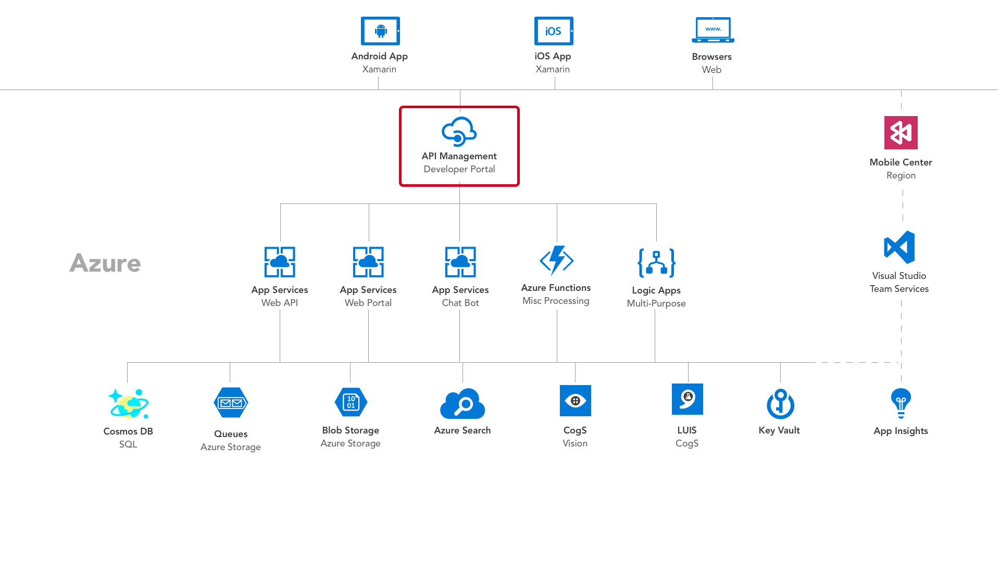
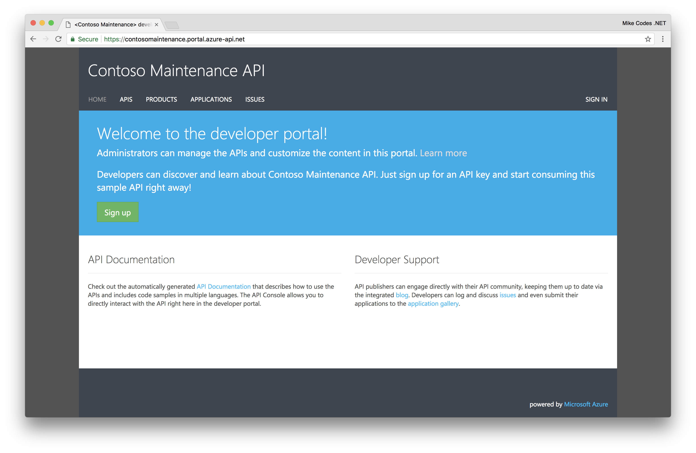
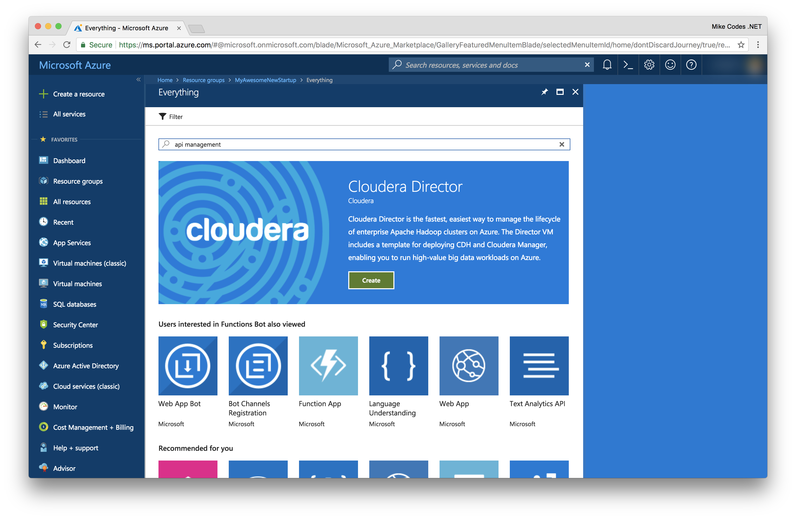
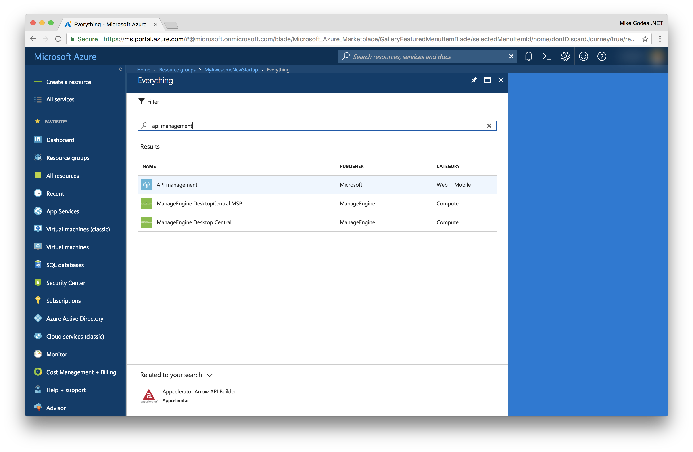

# API Management
Azure API Management is a turnkey solution for publishing APIs for external and internal consumption. It allows for the quick creation of consistent and modern API gateways for existing or new backend services hosted anywhere, enabling security and protection of the APIs from abuse and overuse. We like to think of API Management as businesses digital transformation hub as it empowers organisations to scale developer onboarding as well as monitoring the health of services. 

We'll be using API Management in today's workshop to act as both a gateway our Azure Resources and as a source of documentation about what features we've made avaiaible to consumers of our services. 

You can find a our API Management portal running [here](https://contosomaintenance.portal.azure-api.net/)

### Exploring APIs
You can explore APIs with API Management and even get automatically generated snippets in a variety of languages which demonstrat whats required to interact with the Azure services. 

## Deploying API Management 
Lets head over to our Resource Group again and hit the "Add" button again. 

Select the "API Management" result. You'll then navigate to the Creation blade. 
    

Choose the following settings and hit the Create button to start provisioning the API Management instance.

* Name: myawesomeneapi
* Resouce Group: Use existing
* Location: Same as your Web App
* Organization Name: The name of your business (it'll appear in the portals). 
* Administrator Email: Set this to yourself
* Pricing Tier: You can select Developer for this workshop. 

API Management can take about 20 minutes to deploy so now might be a good time to take a quick break if you need it. If you wish to monitor the deployment progress, you can click on the right bell icon. 

It's worth checking that the service is active after deployment as this can take a couple more minutes. 

---

## Understanding our usage
We're using API Management as our access layer, routing all HTTP requests to our backend through it. You can see this below in this basic diagram (it's not the entire architecutre, but more of a high-level overview). 

If we imagine the flow for searching jobs. Our request leaves the phone, hits our API Manager, which will route it to the nearest instance of our backend. The backend that takes the request and routes it to the correct contrller, which has the implementation for interacting with Azure Search. 

## Configuring API Management
Once API has finished its deployment process, we can start to configure it for interacting with the App Service instance we deployed earlier. 

---
### Implementing Operations
We need to define our operations for the API Management. We have already deployed our backend so we should be in a position to hook up to the App Service instance and consume real data. It's worth keeping in mind that its possible to send Mock responses back from API Management, which can help in the development of large solutions. 

To kick off, we'll create the Parts API manually, and then for the rest of the APIs we'll use pre-built OpenAPI Specifications to automagically configure API Management. 

#### Parts

#### Jobs

#### Search

#### Photos
-We're currently experiancing an issue with our implementation of Photo upload. Please bare with us whilst we resolve this. 
