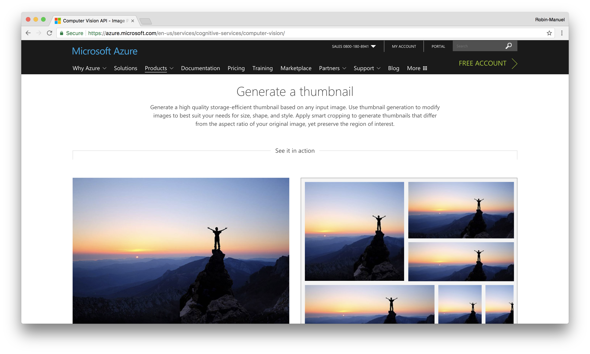
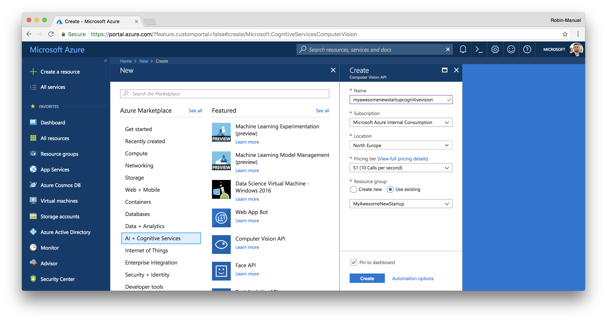
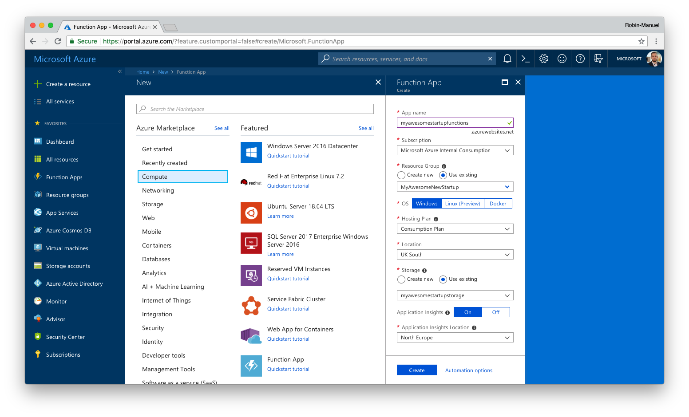
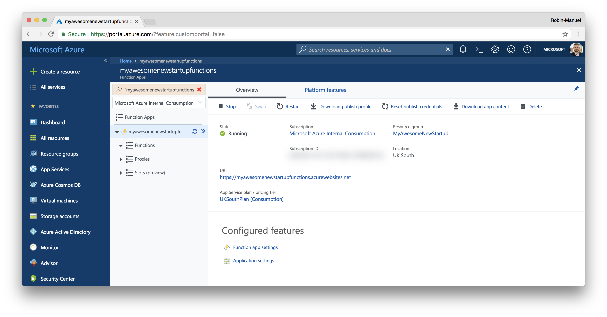
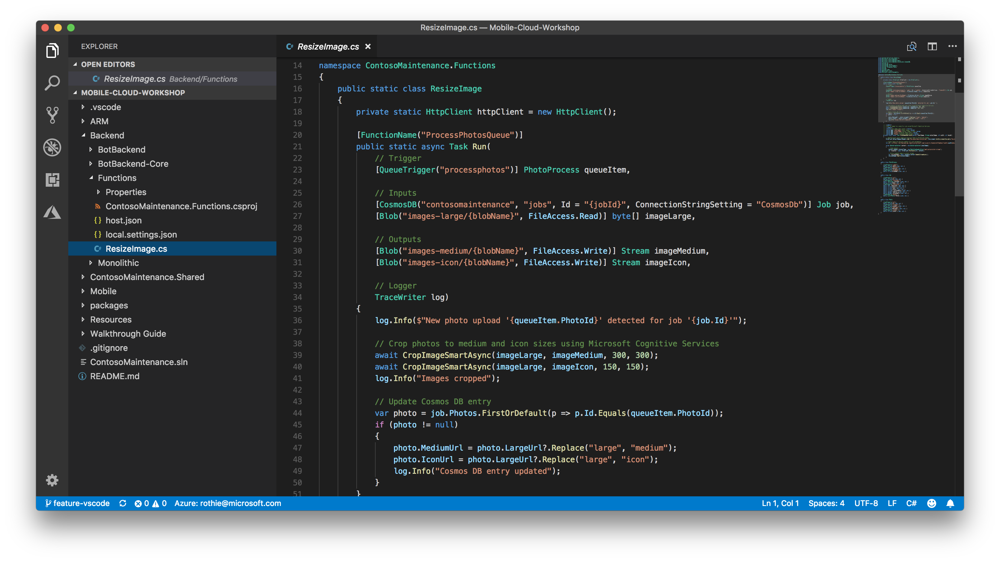
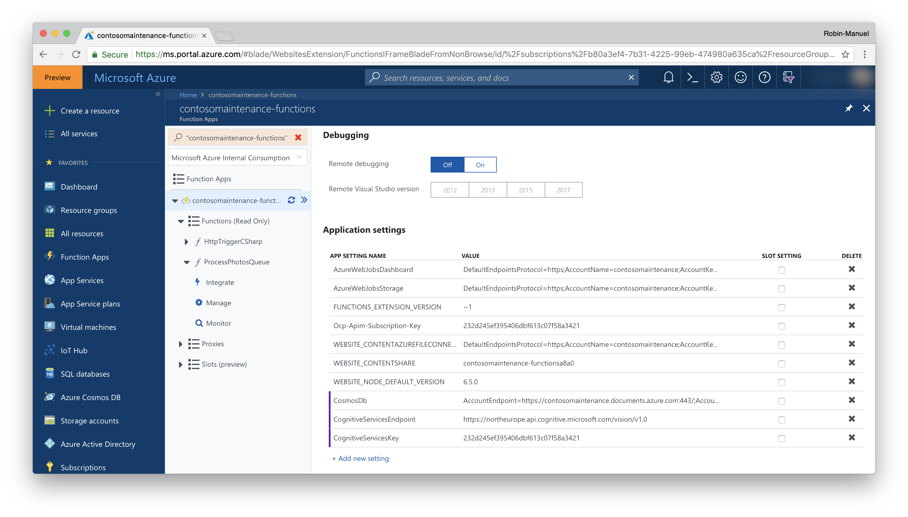
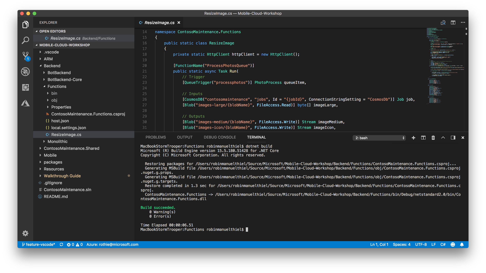
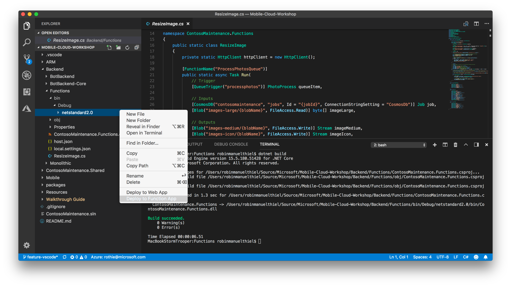
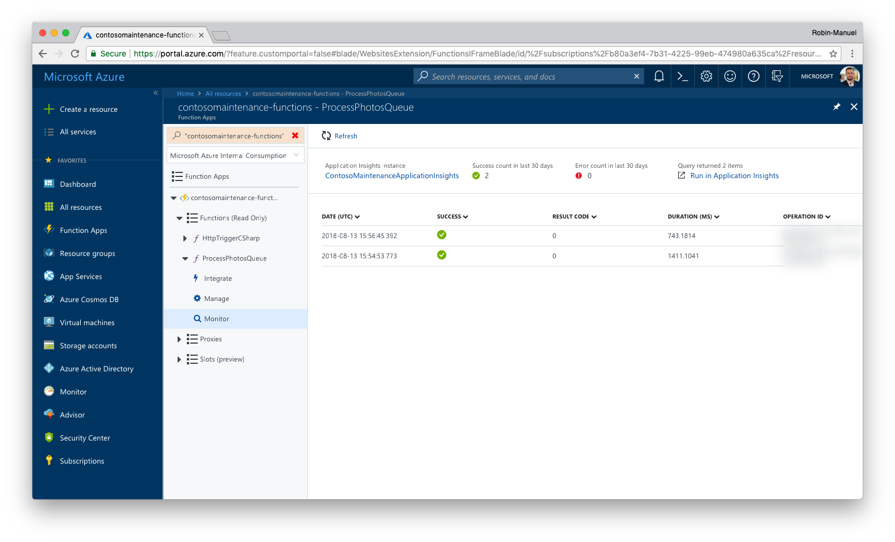

# Smart Image Resizing with Azure Functions and Cognitive Services

We have come to a point where our backend has grown to a pretty solid state so let's do some of the more advanced stuff and add some intelligence to it! Not every developer has a background in Machine Learning and Artificial Intelligence to we should start with something simple: **Resizing uploaded images in an intelligent way**.

You remember, users can add photos to *Jobs* and upload them through the Web API sothat they get stored in the Blob Storage. These photos are uploaded and stored in **full size**, which results in high network traffic and download times when the Mobile App is fetching them. Sometimes the App just needs a small or preview version of the photo, so it would be nice to store some smaller sizes of the photos in addition to the orginnally uploaded ones.

The problem with simple resizing of the images to a certain square resolution like 150 x 150 pixels for thumbnail icons could cut off important parts of a picture that got taken in portrait- or landscape format. This is why it is recommended to use AI to understand what is shown on a picture and crop it accordingly.

## 1. Microsoft Cognitive Services

Great resources of Intelligence Services for developers without deeper Machine Learning knowledge are [Microsoft's Cognitive Services](https://azure.microsoft.com/en-us/services/cognitive-services/). These are a set of pre-trained Machine Learning APIs across various sections like Vision, Speech or Knowledge that developer's can simply include within their applications using a REST API.

### 1.1 Computer Vision for thumbnail generation

One of these APIs is [Computer Vision](https://azure.microsoft.com/en-us/services/cognitive-services/computer-vision/), a service that tries to understand what's on a picture or video. This service can analyze pictures to generate tags and captions, detect adult or racy content, read text in images, recognizes celebrities and landmarks, detects faces and emotions and much more. You should definitely take some time to explore and play around with all these services!



The perfect service for our scenario is the [Thumbnail Generation API](https://westcentralus.dev.cognitive.microsoft.com/docs/services/56f91f2d778daf23d8ec6739/operations/56f91f2e778daf14a499e1fb) which allows us to upload a picture together with a preferred size and get a cropped image back that does not miss out important parts of the original photo.

### 2.1 Get access through Azure

Microsoft Cognitive Services are hosted in various Azure Regions and can be consumed through an Azure Subscription. They are priced by transactions with numerous **free transactions** every month and a pay-per-use model for each additional request.

To add Computer Vision to our solution, enter the [Azure Portal](https://portal.azure.com) and click on the ***Create a resource*** button, find ***AI + Cognitive Services*** and select ***Computer Vision API*** to configure access to the API.



Choose the following settings and hit the ***Create*** button to start.

- **ID:** myawesomenewstartupcognitivevision
- **Location:** Same as your Web App(or close as Cognitive Services are not available in all Regions)
- **Pricing tier:** F0
- **Resouce Group:** Use existing

Once the deployment is succeeded, you can navigate to the resource and access the API Key from the ***Keys*** section.

## 2. Azure Functions

Functions are a **Serverless** component of Microsoft Azure and abstract even more of the underlying hardware that Platform-as-a-Service (PaaS) offerings like App Service does. An Azure Functions basically just persists of a code snipped and some meta information when and how it should get executed. This code snipped sleeps until it got triggered by an event or other service, wakes up then, executes its code and falls asleep again.

This behaviour allows Microsoft to offer a [**very attractive pricing model**](https://azure.microsoft.com/en-us/pricing/details/functions/) where you only pay for pure execution time of an Azure Function. That means you only pay and Azure Function when it is actually used. If you write code that never gets executed, it won't cost you anything! The ultimate idea of cloud computing! Event better, [the first 1 million executions or 400000 GB-s are free](https://azure.microsoft.com/en-us/pricing/details/functions/)!

> **Hint:** Azure Functions are the ideal service to extend existing large backend architectures with additional functionality or to process data in the cloud. The latter is exactly what we need to do when resizing images. 

Whenever a user uploads an image, he should get immediate feedback and should not have to wait for the Cognitive Services. Once the image gets dropped to the Blob Storage, the Function awakes and calls the Cognitive Service API to resize it in a smart way in the background. Next time a user fetches images, he will receive the resized versions.

We have already prepared an Azure Function so we don't need to start from scratch! In the repository, there is an Azure Function called [`ResizeImage.cs`](/Backend/Functions/ResizeImage.cs) that contains the code for our scenario.

1. Get triggered by a Storage Queue message
1. Take an image from Azure Blob Storage
1. Upload it to the Cognitive Services Computer Vision API
1. Write the resized images back to Azure Blob Storage
1. Update the Cosmos DB entry

### 2.1 Create an Azure Function

Multiple Azure Functions are hosted in a *Function App*. To create one, click the ***Create a resource*** button at the top-left corner of the [Azure Portal](https://portal.azure.com), select ***Compute*** from the categories and click on ***Function App***.



Add a *Function App* to your solution using the following properties.

- **App name:** myawesomenewstartupfunctions
- **Resouce Group:** Use existing
- **OS:** Windows
- **Hosting Plan:** Consumption Plan
- **Location:** Same as your Web App
- **Storage:** Use existing (same Storage Account as created for Blob Storage)

Click the ***Create*** button and wait until Azure provisioned your Function App.

#### 2.1.1 Explore Function Apps

Once the Function App has been created, we can navigate to it and start exploring the Dashboard. There is not much to see, as we have not any Functions and the moment and the Function App just acts as a container for those.



There are multiple ways to add Azure Functions. One is to click the small ***+*** button next to the ***Functions*** entry in the side menu and start from scratch. You can see, that Azure Functions are suitable for different scenarios like Webhooks, Timed executions or Data processing. This basically defines when Functions should be triggered. Azure also supports different programming languages.

#### 2.1.2 Tooling

The cross-platform code editor Visual Studio Code supports Azure Functions tooling when the [Azure Functions Extension](https://marketplace.visualstudio.com/items?itemName=ms-azuretools.vscode-azurefunctions) gets added. Open the [`Backend/Functions`](/Backend/Functions/) folder from the repository in Visual Studio Code and explore the code.



Let's quickly explore what has been pre-written for us here!

#### 2.1.3 Triggers

Azure Functions are based on the concept of **Triggers**, which define when a Function should wake up and execute its code. There are several different [Trigger Bindings](https://docs.microsoft.com/en-us/azure/azure-functions/functions-triggers-bindings) that can be defined in the function's source code or configuration files. Our function uses the [Queue Storage Binding](https://docs.microsoft.com/en-us/azure/azure-functions/functions-bindings-storage-queue) as a Trigger so it wakes up whenever a new message appears in a Storage Queue.

> **Hint:** Do you remember the Storage Queue that we created earlier? Our Web API backend sends a small message with a `jobId` and `photoId` to the queue every time a new photo got uploaded. So the Function will fire up every time a photo gets uploaded.

```csharp
// Trigger
[QueueTrigger("processphotos")] PhotoProcess queueItem,
```

[View in project](/Backend/Functions/ResizeImage.cs#L22)

It listens on a Storage Queue called `processphotos` and wakes up once a new message arrives in there. Then it takes the message `PhotoProcess queueItem` and starts processing it.

#### 2.1.4 Inputs and Outputs

When an Azure Function awakes, it can fetch additional **Inputs** from multiple sources that are needed for the processing. Similar to the Triggers, these Inputs also use [Bindings](https://docs.microsoft.com/en-us/azure/azure-functions/functions-triggers-bindings). Beside the Queue message itself that wakes our Function up, it needs two additional inputs: The uploaded photo from the Blob Storage and the *Job* document from Cosmos DB. These are also defined in the function's code.

```csharp
// Inputs
[CosmosDB("contosomaintenance", "jobs", Id = "{jobId}", ConnectionStringSetting = "CosmosDb")] Job job,
[Blob("images-large/{photoId}.jpg", FileAccess.Read)] byte[] imageLarge,
```

[View in project](/Backend/Functions/ResizeImage.cs#L25-L26)

This passes a `Job job` based with its `id` set to `{jobId}` and a `byte[] imageLarge` from `/images-large/{photoId}.jpg` to the Function. The values `{jobId}` and `{photoId}` are from our Trigger the `PhotoProcess queueItem`.

Azure Function Outputs follow the same process. As we want to write two images to our Blob Storage (a medium sized and icon sized one), we define two outputs of the same Binding type.

```csharp
// Outputs
[Blob("images-medium/{photoId}.jpg", FileAccess.Write)] Stream imageMedium,
[Blob("images-icon/{photoId}.jpg", FileAccess.Write)] Stream imageIcon,
```

[View in project](/Backend/Functions/ResizeImage.cs#L29-L30)

Both `Stream` objects get passed to the Function. The rest of the code just connects the dots.

### 2.3 Integrate with Storage, Cosmos DB and Cognitive Services

Of course, all these Trigger, Input and Output [Bindings](https://docs.microsoft.com/en-us/azure/azure-functions/functions-triggers-bindings) have to be configured. As we might be already used to from the App Service, this configuration is done via Environment Variables. Each Azure Function has a `local.settings.json` file that sets Connection Strings to the used services.

```json
{
    "IsEncrypted": false,
    "Values": {
        "AzureWebJobsStorage": "<Storage Connection String>",
        "AzureWebJobsDashboard": "<Storage Connection String>",
        "CosmosDb": "<CosmosDB Connection String>",
        "Ocp-Apim-Subscription-Key": "<Cognitive Services Computer Vision API Key>"
    }
}
```

[View in project](/Backend/Functions/local.settings.json)

For local tests, the Environment Variables can be set in this file, when uploading the Function to Azure, we should save them in the Function App's Application Settings. Navigate to the ***Function App*** in the [Azure Portal](https://portal.azure.com), open the ***Application Settings*** and add the Keyes.



Add the settings like the following - getting the values from the relevant sections of your previously created Azure resources.

- **AzureWebJobsDashboard:** *Key 1 Connection String* from the Storage Account ***Access keys*** section (should be already set)
- **AzureWebJobsStorage:** *Key 1 Connection String* from the Storage Account ***Access keys*** section (should be already set)
- **CosmosDB:** *Primary Connection String* from the Cosmos DB ***Keys*** section
- **Ocp-Apim-Subscription-Key:** *Key 1* from the Cognitive Service ***Keys*** section

Scroll up and click ***Save*** to set the Environment Variables for the Function App.

### 2.6 Deploy to Azure

Similar to the ASP.NET Core Web API project, we also need to compile the Azure Function code into an executable, before we can upload it to the cloud. For this, right-click the `Functions` folder in Visual Studio Code and select ***Open in Terminal / Command Line***.

The Terminal window in Visual Studio Code pops up and we can enter the command to compile the application.

```bash
dotnet build
```

The output should look like this and we should see the **Build succeeded** message.



Again, building (compiling) the code generated two more folders for us: `/bin` and `/obj`. Here we can find executable files that we can upload to the cloud. As an Azure Function only constists of .NET code, no `dotnet publish` is needed for it. 

Inside our `Functions` folder, we should now find a `bin/Debug/netstandard2.0` folder that contains our ready-to-run backend logic. Now you can simply right-click this `netstandard2.0` folder and select ***Deploy to Function App***.



Follow the process of selecting a Subscription and Function App to publish to, confirm the publish process.

> **Hint:** Visual Studio Code might ask you if you want to override the Remote Runtime. This is because at the time of the creation of this workshop, the Azure Functions Runtime `~1` is set as default when creating a new function app. As we are already using the `beta` version of Runtime 2 in this workshop, we need to update this in Azure, too.

> **Hint:** Sometimes, Visual Studio Code fails to load Subscriptions for your account when publishing. To fix this, go back to the ***Azure*** tab in Visual Studio Code and refresh the list of Subscriptions. Now start the Publish process again.

### 2.7 Test your Azure Function

Back in the [Azure Portal](https://portal.azure.com), we can monitor how our Azure Function behaves. For this, select the ***Monitor*** tab beneth your Function.

For each execution, we can check *Status* and *Execution Time* as well as additional details like *Logs* and *Parameters* when clickinng on  a single execution.



To check if the Function is runninng as expected, we can trigger it by uploading another image. So let's open [Postman](https://www.getpostman.com/) again and upload other image with using the API ([like we did before](../04%20Data&20Storage#24-test-the-photo-upload)).

Once the photo has been uploaded, we should see a successful execution of the Azure Function in the Portal and two new resized pictures in the Blob Storage.

---
# Next Steps 
[Mobile Options](../08%20Mobile%20Overview/README.md)
