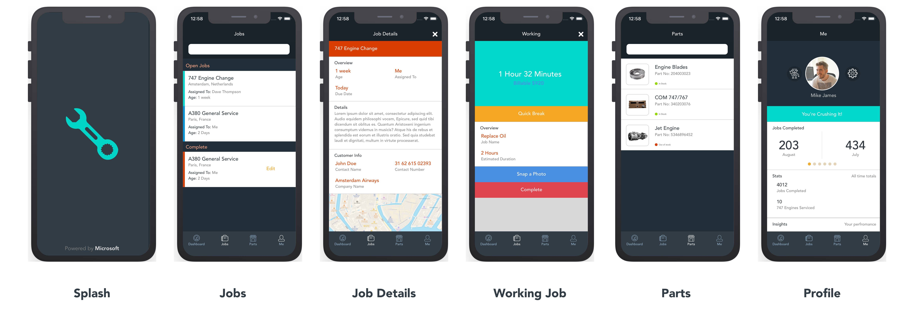
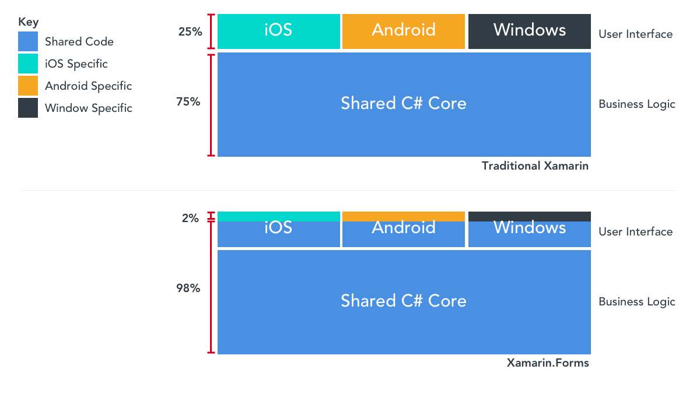

# 1. Mobile Overview
The mobile app currently runs on both iOS and Android devices using Xamarin.Forms. Although UWP, macOS and Linux support should technically also work, they're outside the scope of today's learnings.

### 2.1 Development SDK
The apps have been developed with [Xamarin.Forms](https://github.com/xamarin/Xamarin.Forms) targetting .NET Standard 2.0. You should find all your favourite .NET libraries will work with both the backend (also targeting .NET Standard 2.0) and the mobile apps. 

Using Xamarin.Forms makes it possible for us to write our app just once using C# and XAML and have it run natively on a variety of platforms. This is achieved as it's an abstraction API built on top of Xamarin's traditional mobile development SDKs. Looking at the architecture below, you can see that with traditional Xamarin we can achieve up to 75% code reuse through sharing the business logic of our app.

Before we jump into Xamarin.Forms in any depth let take a moment to understand the underlying technology and how this works. 

#### Traditional Xamarin 
Traditional Xamarin is a one-to-one mapping of every single API available to Objective-C and Java developers for C# developers to consume. If you're familiar with Platform Invokation, then you'll already be familiar with the core concepts of how Xamarin works. It's this one-to-one mapping that is the platform-specific element of a Xamarin app. It's not possible to share the UI layer from iOS to Android when developing with Traditional Xamarin as you won't find iOS APIs such as UIKit as part of the Android SDK. This means that our user interface is unique for the platform and we can create the amazing user experience our users expect from mobile apps. 

Where we can share code is the business logic or 'boring bits' of the application. As a general rule, if you writing code that is using only the Base Class Library (BCL) then you should be a great position to reuse this code as the Share C# Core of your app. If you've got existing .NET libraries that you'd like to analyze, then you should install the [.NET Portability Analyzer](https://marketplace.visualstudio.com/items?itemName=ConnieYau.NETPortabilityAnalyzer). 

Traditional Xamarin apps perform exceptionally well compared to their 'native native' counterparts, with some benchmarks showing a notable performance increase when picking Xamarin over the 'native native' approach. 

One concern we hear from potential users of Xamarin is taking on a large dependency like the Mono runtime in their app. Its worth understanding that our build process does much to reduce the size of our final binary. When building any Xamarin app for release, we make use of a Linker to remove any unused code, including the Mono Runtime and your code. This significantly reduces the size of the app from Debug to Release. 

You should consider Traditional Xamarin when you care about code-reuse but not as much as customisation. It's also a great fit if you've experienced with Objective-C, Swift or Java in a mobile context but wish to leverage an existing .NET code base. 

#### Xamarin.Forms
Xamarin.Forms is an open-source, cross-platform development library for building native apps for iOS, Android, Mac, Windows, Linux and more. By picking Xamarin.Forms, we're able to reuse our previous experience with Silverlight, WPF and UWP development to target a variety of new platforms. It being an abstraction over Traditional Xamarin means that it still produces 100% native apps that using the same build process but we can write our code in a .NET Standard library to be shared across multiple platforms. 

Xamarin.Forms is a fantastic technology for building mobile apps if you've previous experience with MVVM, WPF or Silverlight. It focuses on code-reuse over customisation, but that doesn't limit us from dropping down into platform specific APIs when we want to add deeper integrations to the underlying platforms. 

Xamarin.Forms come with 24 controls out of the box, which map directly to their native type. For example, a Xamarin.Forms Button will create a Widget.Button on Android and UIKit.UIButton on iOS. Forms provide a consistent API across all the platforms it supports. This allows us to ensure that functionality we call on iOS will behave the same on Android.

Forms is a great way to leverage existing C# and .NET knowledge to build apps for platforms you may have historically considered not .NET compatible. 

We're using C#, though we could have picked F#. We opted not to, given we're terrible F# developers and we want you to learn something today. If you fancy learning a little bit of information on functional programming with Forms, then check out the [blog post](http://www.charlespetzold.com/blog/2015/10/Writing-Xamarin-Forms-Apps-in-FSharp.html) by Charles Petzold (author of the [Xamarin.Forms ebook](https://developer.xamarin.com/guides/xamarin-forms/creating-mobile-apps-xamarin-forms/)), who writes a guide on how to get started. 

### 2.2 Mvvm with FreshMvvm
We opted to use [FreshMvvm](https://github.com/rid00z/FreshMvvm) as our MVVM library due to its small size and flexibility. It's specifically designed for Xamarin.Forms and offers lots of helpful extensions to navigation which we make full use of. 

### 2.3 Architecture 
We've tried to keep the platform-specific code to a minimum with the development of this app. This is because we wanted you to see how its possible to create pleasant user experiences while maximising code reuse.

#### Core Project
The core project contains our app's Pages, ViewModels (we call them PageModels), Models and network services. 

As we're using the MVVM architecture, we have a clear separation of concerns within our app. 

#### 3rd Party Packages*
* CarouselView.FormsPlugin
* Airbnb Lottie 
* Corcav.Behaviors
* FormsToolkit
* FreshMvvm
* Humnizer
* Refit
* MvvmHelpers
* SkiaSharp.Svg
* Plugin.Media
* Plugin.ImageCircle
* Plugin.Settings
* FFImageLoading.Forms
* FFImageLoad.Transformations

---
# Next Steps 
[Mobile Network Services](../08_Mobile_Network_Services/README.md)
